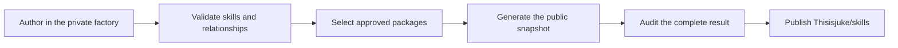

# Why this repository exists — and how it is made

_The goal is not to collect as many prompts as possible. It is to build agents
from skills that are reliable on their own and stronger together._

[`Thisisjuke/skills`](https://github.com/Thisisjuke/skills) is the public,
generated output of my private skill factory. It contains the packages I have
deliberately selected, reviewed and licensed for sharing—not drafts,
experiments or whatever happened to be in my working directory.

That distinction supports the real purpose of the project: composing agents.
A useful agent should not depend on one enormous prompt that mixes planning,
implementation, review and technology rules. It should be possible to choose
small skills with clear responsibilities, combine the ones a task needs and
understand what each one contributes.

## The target is a composed agent, not a pile of prompts

This repository treats an agent as a composition of focused capabilities. A
skill contributes one method, one body of expertise or one specialized lens;
the agent combines those parts for a concrete job.

A React review agent is a useful example:

```text
review + react + react-review + accessibility
```

[`review`](./foundations/review/) supplies the technology-neutral review
method. [`react`](./technologies/react/) adds component, rendering, state and
lifecycle constraints. [`react-review`](./technologies/react/react-review/)
adds React-specific defect patterns, while
[`accessibility`](./foundations/accessibility/) adds an explicit accessibility
standard and representative interaction modes.

Each layer has a reason to exist, and none needs to pretend it owns the entire
agent. The pattern also leaves room for extension: a missing ecosystem can add
its own `<tech>` and `<tech>-review` packages while reusing the same generic
review method.

## A skill is a small package with one clear responsibility

Every directory containing a `SKILL.md` is an independently copyable package.
The file states the skill's outcome, workflow, boundaries, evidence standards
and behavior when another capability is unavailable. Supporting
`references/`, `scripts/` and `assets/` stay inside the same directory so the
package does not depend on undocumented repository context.

Keeping responsibilities narrow makes a skill easier to understand, test,
replace and combine. `review` does not quietly become React guidance;
`react-review` does not reinvent the complete review process. This deliberate
overlap boundary is what makes both skills reusable rather than incomplete.

“Unitary” does not mean isolated from every other skill. It means the package
has a coherent owner and an explicit contract. A user can select several
independent skills as layers, while a workflow that genuinely delegates work
to another skill declares that relationship instead of hiding it in prose.

## The directory structure is part of the product

The public tree organizes skills by the kind of contribution they make to an
agent. The folders are a navigation and composition model, not a mandatory
pipeline:

- [`foundations/`](./foundations/) contains technology-neutral methods for
  specification, planning, implementation, testing, debugging and review;
- [`common/`](./common/) contains reusable product and engineering workflows
  such as interviewing, research, API design, security and handoff;
- [`discover/`](./discover/) contains subject-specific workflows that qualify
  a fast-moving ecosystem before anything is selected or installed;
- [`technologies/`](./technologies/) contains language, platform and
  specialization layers, with nested skills for deeper build, testing,
  performance or review guidance;
- [`tooling/`](./tooling/) contains workflows used to prepare repositories and
  to source, author and evaluate skills themselves.

This ordering answers two different questions: “What kind of capability am I
adding?” at the top level, and “How specialized does it need to be?” as paths
become deeper. A predictable location and a machine-readable
[`skills.json`](./skills.json) catalogue make discovery possible for both
people and tools.

The technology root follows real ecosystem boundaries rather than forcing
everything into a single language hierarchy. It currently includes focused
families for:

- [`design-system`](./technologies/design-system/), including component APIs,
  tokens, accessibility, build, testing and review concerns;
- [`react`](./technologies/react/), including build, testing, performance,
  review, actions/forms and server-component specializations;
- [`shadcn`](./technologies/shadcn/), with focused data-table and registry
  workflows that can compose with Tailwind CSS and TanStack Table;
- [`storybook`](./technologies/storybook/), with build, documentation, testing,
  review and visual-testing layers;
- [`tailwindcss`](./technologies/tailwindcss/) and
  [`tanstack-table`](./technologies/tanstack-table/) for their own project
  contracts;
- [`java`](./technologies/java/) and [`java-me`](./technologies/java-me/) for
  language, runtime and constrained-device work.

Discovery remains separate from those usage skills. For example,
[`discover-shadcn`](./discover/discover-shadcn/) owns the search and
qualification of current shadcn/ui options; once a choice is made,
[`shadcn`](./technologies/shadcn/) owns using it safely in a real project.

## Composition is explicit, but it is not automatic magic

The collection supports two forms of composition. A user can select
independent layers for an agent, as in the React review example. No metadata
edge is required for that choice. Separately, a skill can delegate a defined
part of its own workflow to another installed skill.

Declared delegation uses two relationships:

- `ALWAYS CALLS` means the caller cannot deliver its advertised outcome
  without the target;
- `CALLS WHEN NEEDED` means the target is used only when a documented condition
  occurs.

The caller still explains when the delegation happens, what context is passed,
which responsibility remains with each skill and what happens when the target
is missing. Calls never install packages, expand permissions or silently copy
an absent workflow. The active call graph is also checked for cycles.

This makes dependencies inspectable without turning the collection into a
framework. An agent harness may automate declared calls, a person may select a
set manually, and a copied package still states enough of its contract to fail
clearly or continue safely within its own boundary.

## The public repository is a generated release

The private factory is the canonical authoring workspace; this repository is a
reviewed distribution. The factory contains active skills, authoring tools,
tests and non-ready candidates. The public repository contains only packages
that have been explicitly selected and approved for publication.

That separation keeps the public collection clean. Half-finished ideas,
private helpers and short-lived notes can exist in the workshop without
becoming accidental public API. Conversely, a useful authoring tool can be
published intentionally when it satisfies the same package contract as the
rest of the collection.

There is no reverse synchronization from generated files. Durable changes are
made in the factory, reviewed there and projected into the public tree. This
avoids maintaining two competing copies of the same skill.



## Public selection is a reviewable decision

A small declarative manifest maps canonical factory packages to their public
destinations. Public status is never inferred from a folder name, a custom
frontmatter flag or an agent's opinion that a draft looks finished.

The manifest makes additions, removals and path changes visible in review. A
selected package must be ready, declare the MIT license and satisfy the
structural contracts. Selection never repairs a missing dependency or promotes
a candidate implicitly; those remain separate authoring decisions.

This explicit boundary also protects the organization of the public tree. The
factory can evolve internally while published paths remain deliberate and
readable.

## Generation is deterministic by design

Agents can help author and review a skill, but they do not improvise the public
release. A narrow Python generator projects the approved manifest into the
same bytes, paths and executable modes for the same factory revision.

Before writing, it validates package metadata, licenses, paths and declared
relationships. It rejects unsafe paths and symbolic links, includes nested
packages only when they are independently selected, preserves supporting
files, and produces a sorted machine-readable catalogue. The call graph must
remain acyclic; missing mandatory targets block the selected distribution,
while missing conditional targets remain visible warnings.

Writes are atomic: the complete output is prepared and validated before it
replaces the previous snapshot. A separate check compares the committed tree
with a fresh projection, including paths, bytes, entry types and executable
modes. Generated therefore means reproducible and reviewable, not opaque.

## Verification makes reliability repeatable

The factory exposes one verification command for local development and CI. It
covers unit and integration tests, candidate metadata, skill contracts,
declared relationships, repository instruction scope, deterministic generation
and the final public audit.

Using the same gate locally and on pull requests prevents CI from becoming a
hidden release ritual. A contributor can reproduce the checks before review,
and a generated diff can be inspected before any public synchronization takes
place.

After a change reaches the factory's main branch, publication runs the full
gate again. A short-lived GitHub App token is requested only for synchronizing
the public repository. Empty releases are skipped, concurrent releases cannot
race, and each public commit records the factory revision that produced it.

## The machinery exists to make the skills boring to trust

Installing a skill should not require understanding the factory. You can use
the Skills CLI or copy one complete package directory. You can start with one
focused workflow, then add foundations, discovery, technologies and
specializations as your agent's job becomes more precise.

The factory, manifest, generator and verification gate exist so that this
simple usage rests on visible guarantees: clean packages, predictable
organization, explicit relationships, reproducible releases and reviewed
public contents.

That is the trade: the authoring system absorbs the complexity so the public
repository can remain a dependable set of unitary, composable building blocks
for agents.
